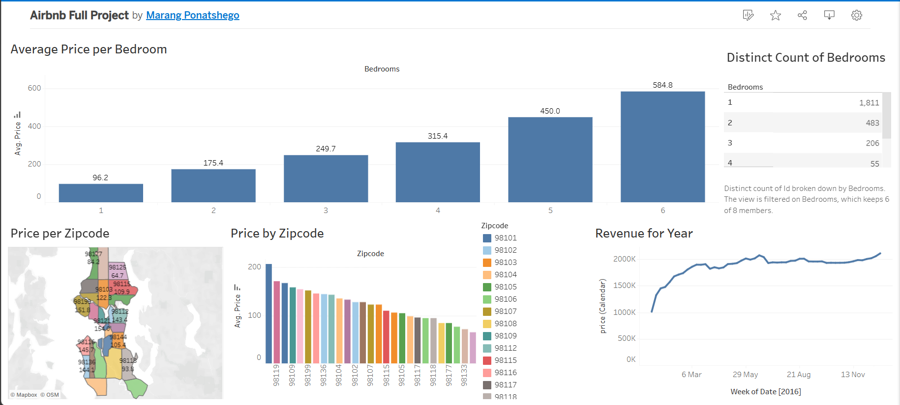

# Seattle Airbnb Market — Tableau Dashboard

An interactive Tableau Public dashboard analyzing Seattle Airbnb
listings from **2016**. The analysis explores how listing prices vary
by the number of bedrooms and by zipcode, and how revenue accumulated
over the year.

**🔗 Live dashboard:** [View on Tableau Public](https://public.tableau.com/app/profile/marang.ponatshego/viz/AirbnbFullProject_17893983137110/Dashboard1)

**Tool:** Tableau Public
**Dataset:** Seattle Airbnb Open Data (2016)

---

## Dashboard overview

The dashboard presents five views:

| Visual | Type | What it shows |
|---|---|---|
| Average Price per Bedroom | Bar chart | Price increases with bedroom count |
| Distinct Count of Bedrooms | Text table | Listing distribution across bedroom sizes |
| Price per Zipcode | Map | Geographic price variation across Seattle |
| Price by Zipcode | Bar chart | Ranked zipcodes by average price |
| Revenue for Year | Line chart | Cumulative weekly revenue, March–November 2016 |

---

## Key findings

### 1. Price scales sharply with bedroom count

Average price per listing follows a clean, near-linear climb:

| Bedrooms | Avg price |
|---|---|
| 1 | **$96** |
| 2 | **$175** |
| 3 | **$250** |
| 4 | **$315** |
| 5 | **$450** |
| 6 | **$585** |

Each additional bedroom adds roughly **$90–$135** to the average
listing price. The jump from 5 to 6 bedrooms is the steepest — a
signal that large luxury listings command a premium.

### 2. The market is dominated by 1-bedroom listings

Of the ~2,555 total listings, **1,811 are 1-bedroom units (71%)**.
2-bedroom units are a distant second (483, ~19%). Larger units are
rare — only 55 listings have 4 bedrooms. This tells us Seattle's
Airbnb market is primarily built for **individual travelers or
couples**, not groups.

### 3. Price varies widely by zipcode

The highest-priced zipcodes cluster in **central and northern Seattle**
(near downtown, Capitol Hill, and waterfront neighborhoods), while
lower-priced listings concentrate in **southern and outer zipcodes**
(98118, 98133). The gap between the highest and lowest zipcode averages
is roughly **3×** — a substantial geographic spread.

### 4. Revenue grew steadily through 2016

Cumulative revenue climbed from ~**$1M in early March** to over
**$2M by mid-November** — a doubling over roughly 8 months. Growth was
steepest in the spring and slowed through the summer before climbing
again in the fall. This is consistent with seasonal patterns in the
Seattle travel market.

---

## Files in this repo

| File | What it is |
|---|---|
| `01-dashboard.png` | Static screenshot of the dashboard |

The full interactive dashboard is hosted on Tableau Public — click the
link at the top of this README to explore it in the browser.

---

## Notes

- Tableau Public dashboards are **fully interactive** — filters, tooltips,
  and drill-downs work in the browser. No download required.
- This analysis uses a public dataset and is intended as a portfolio
  demonstration of Tableau skills.

---

## Skills demonstrated

- Tableau Public — workbook design and publishing
- Chart selection — bar, map, line, and text table visuals
- Geographic analysis (zipcode-level mapping)
- Time-series visualization (cumulative revenue)
- Dashboard layout and composition
